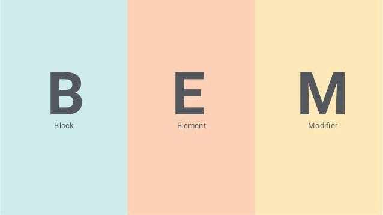
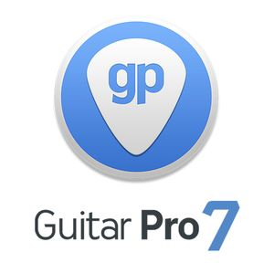

[Кликни, чтобы посмотреть моё резюме](https://izmailowalex.github.io/CV/)

# Aleksandr Izmailow

<div>
    
</div>

---

## Контакты:

<div>
  <a href="https://www.linkedin.com/in/aleksandr-izmailow/">
    
  </a>
  <a href="https://www.codewars.com/users/rsschool_fedffb7cb5e5775b">
    
  </a>
  <a href="https://github.com/izmailowAlex">
    
  </a>
</div>

- Местонахождение: Минск, Беларусь
- Телефон: +375 29 217 12 40
- Телеграм: @aleks_bass
- Gmail: zippon28@gmail.com

---

## Обо мне:

<p>Привет! <br/>
<span>Я Фронтенд-разработчик, создаю веб-сайты, делаю вёрстку по макету Figma, разрабатываю игры и мобильные приложения, также умею работать с REST API.
Меня увлекает программирование и я всегда стремлюсь изучать и внедрять новые технологии и подходы в разработке. Анализирую сложности, возникающие по мере создания проектов и ищу эффективные решения. Гибко адаптируюсь к изменениям и успешно функционирую в динамичных рабочих условиях. Умею работать в команде и быстро нахожу общий язык со всеми участниками проекта. Спокойно отношусь к конструктивной критике и использую её для улучшения своей работы.</span></p>

---

## Качества:

- Умение анализировать проблемы и находить эффективные решения
- Стремление планировать и организовывать свою работу нацеленную на результат
- Быстро адаптируюсь к изменениям в работе
- Готовность брать на себя ответственность за результат
- Способность быстро находить общий язык с командой
- Как связаться со мной: [](https://www.linkedin.com/in/aleksandr-izmailow/)

---

## Навыки :

<div>
  &nbsp;
  &nbsp;
  &nbsp;
  &nbsp;
  &nbsp;
  &nbsp;
  &nbsp;
  &nbsp;
  &nbsp;
  &nbsp;
  &nbsp;
  &nbsp;
  &nbsp;
  &nbsp;
  
</div>

---

## Пример кода:

```javascript
function stairsIn20(a) {
  return 20 * a.reduce((s, a) => s + a.reduce((s, n) => s + n, 0), 0);
}
```

## Образование:

- [RSSchool - Школа программирования "The Rolling Scopes School"](https://rs.school/) - Front-end веб-разработчик 2023
- [MyITSchool - Учебный центр "Моя Айти Школа"](https://myitschool.by/) - Front-end веб-разработчик 2022
- БГАМ - Белорусская Государственная Академия музыки 2006-2011
- НГМК - Новополоцкий Государственный Музыкальный колледж 2001-2005

---

## Опыт работы:

- Hotel "Rixos Bab al Bahr 5\*" (Dubai, Ras-al-Khaima) (музыкант кавергруппы) июнь 2023 - октябрь 2023
- Образцово-показательный оркестр (артист оркестра) 2020 - 2023
- Белгосфилармония (артист ансамбля) 2010 - 2019

---

## Языки:

- Английский - B1 (обучаюсь в школе иностранных языков "Streamline")
